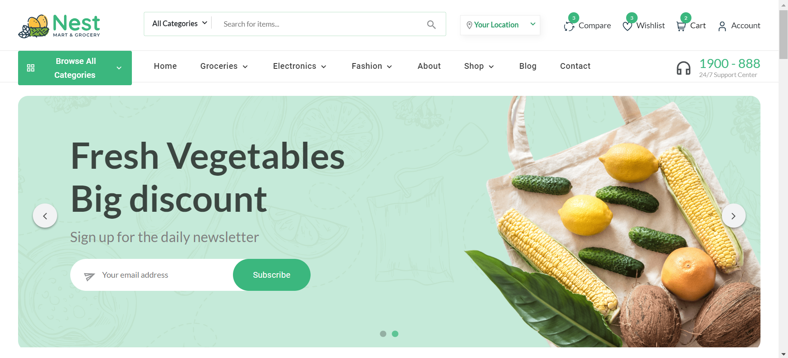

<div align="center">

# Nest ONDC Project


</div>

<div align = "center">
<br>

[](https://opensource.org/licenses/MIT)

<table align="center">
    <thead align="center">
        <tr border: 1px;>
            <td><b>🌟 Stars</b></td>
            <td><b>🍴 Forks</b></td>
            <td><b>🐛 Issues</b></td>
            <td><b>🔔 Open PRs</b></td>
            <td><b>🔕 Close PRs</b></td>
        </tr>
     </thead>
    <tbody>
         <tr>
            <td></td>
             <td></td>
            <td></td>
            <td></td>
           <td></td>
        </tr>
    </tbody>
</table>
</div>

## Project Description

Our project is an ONDC (Open Network for Digital Commerce) site integrated with OpenStreetMap. The aim is to provide a seamless digital commerce experience for businesses and consumers across Bharat. The platform leverages ONDC APIs for data exchange and integration with various digital commerce services.

### Additional Resources:
- **YouTube Video Link:** [NestOndc](https://www.youtube.com/watch?v=-WzV5HD6KMo)
- **Deployment Link:** [Link](https://nestondcshop.vercel.app/)


<div align="center">

## -> Key Features <-
</div>

- **Integration with ONDC APIs:** Seamless integration with ONDC APIs for enhanced functionality.
- **OpenStreetMap Integration:** Utilizes OpenStreetMap for accurate and reliable location-based services.
- **Full-stack Development:** Developed using a full-stack approach to ensure a seamless user experience from frontend to backend.
- **Responsive Frontend Design:** Designed with responsiveness in mind, ensuring accessibility across various devices and screen sizes.
- **Secure Backend Architecture:** Built with a secure backend architecture to ensure the safety and integrity of user data.


<div align="center">

## 💻 Tech Stacks


 

</div>

## Installation
1. **Clone the repository:** 
    ```bash
    git clone https://github.com/MAVRICK-1/e-commerce_website.git
    ```
2. **Navigate to the project directory:** 
    ```bash
    cd e-commerce_website
    ```
3. **Install dependencies:** 
    ```bash
    npm install
    ```
    ```bash
    npm run prepare
    ```
4. **Run the development server:** 
    ```bash
    npm start
    ```

## Usage
- **Access the ONDC platform:** Use the provided URL to access the platform.
- **Explore digital commerce services:** Navigate through various features and services offered.
- **Utilize location-based services:** Take advantage of the integrated OpenStreetMap for location-based functionalities.
- **Interact with the platform:** Engage with the website to experience seamless digital commerce.

## Contributing

Thank you for considering contributing to our project! To contribute, follow these steps:

1. **Fork the repository:** Click on the "Fork" button on the top right corner of the repository page.
2. **Create your feature branch:** 
    ```bash
    git checkout -b feature-name
    ```
   Replace `feature-name` with a descriptive name for your feature.
3. **Commit your changes:** 
    ```bash
    git commit -am 'Add some feature'
    ```
4. **Push to the branch:** 
    ```bash
    git push origin feature-name
    ```
5. **Submit a pull request:** Once you have pushed your changes to your forked repository, go to the original repository and click on the "New pull request" button. Fill out the necessary information and submit your pull request.

#### We appreciate your contributions and will review your pull request as soon as possible. Thank you for helping to improve our project!


 
<h2 align = "center"> 🤝 Our Contributors</h2>
<div align = "center">


 
 <h3>Thank you for contributing to our repository</h3>

</div>
<br>
<div align=center>
  <h2>This Project is the part of</h2>
  
  
</div>

## License
This project is licensed under the [MIT License](LICENSE).

## Acknowledgements
We extend our heartfelt gratitude to the organizers of GSSOC for offering this invaluable platform to exhibit our talents and make meaningful contributions to the open-source community. Your efforts in fostering a collaborative environment for budding developers are commendable, and we are privileged to be a part of such an esteemed event. Thank you for providing us with the opportunity to showcase our skills and contribute to the advancement of open-source technology.

<h2 align="center">Don't forget to give us a ⭐</h2>
